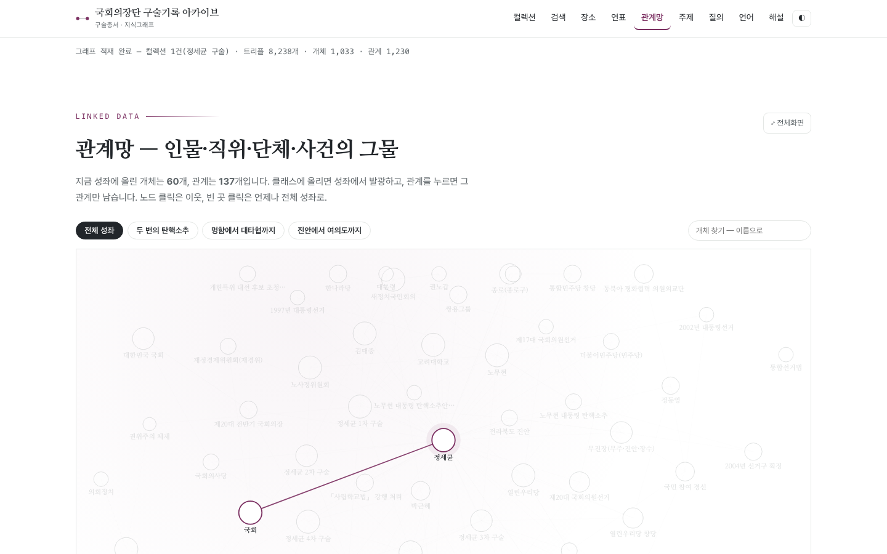

# 서비스킷 — 구술기록 지식그래프

**2026 온톨로지·지식그래프 실습** (2026. 8. 19. 수 · 국회기록원 의정관 105호 · 강사 안대진)

**바로 열기 → https://archivelabedu.github.io/ontology-starterkit/**
오전 학습킷 → https://archivelabedu.github.io/ontology-site/

정세균 구술기록으로 만든 **동작하는 완성본**입니다. 오전에는 시연으로 보고,
오후 **15:30–16:00 「탐색」** 시간에 여러분이 만든 `.ttl` 을 여기에 올려 지식그래프를 탐색합니다.


<sub>관계망 화면. 트리플 8,238개가 그대로 화면이 된다 — 그래프에 없는 것은 그려지지 않는다.</sub>

---

## 실습에서 할 일 — 세 갈래

| | 무엇 | 필요한 것 | 시간 |
|---|---|---|---|
| **A** | 내 RDF(`.ttl`)를 올려 탐색 | 브라우저만 | 5분 |
| **B** | 클론해 **우리 기관 아카이브**로 개조 | GitHub 계정 · Claude Code | 20분~ |
| **C** | `.ttl` 만 주고 **완전히 새 화면**을 만들기 | Claude Code | 20분~ |

A 로 확인하고, 시간이 남으면 B 나 C 로 갑니다. 발표는 자기 노트북 화면으로 합니다.

---

## A. 내 RDF(.ttl) 올려 탐색하기 (클론 없음)

1. 그라운더(또는 구술기록관리시스템)에서 **`.ttl` 내려받기**
2. https://archivelabedu.github.io/ontology-starterkit/#collection 열기 — 「RDF(.ttl) 올려 컬렉션 더하기」
3. **컬렉션 이름**을 적고(예: `3팀 박희태 구술`) 파일 고르기 → 곧바로 적재됩니다
4. 검색·지도·연표·관계망·주제·질의 메뉴로 **내 그래프**를 돌아봅니다

알아 둘 것

- 파일은 **올린 브라우저에만** 남습니다(localStorage). 서버·GitHub 로 가지 않으므로 옆 사람 화면에는 발행본만 보입니다.
- 문법이 깨진 파일은 얹지 않고 오류 줄을 알려 줍니다 — 본 그래프는 손상되지 않습니다.
- 여러 팀이 **같은 이름**을 올려도 섞이지 않습니다(지역명에 `-2`, `-3`).
- 프로파일(`data/ontology.rdf`)에 없는 술어가 있으면 **경고만** 하고 싣습니다. 발표 자료로 쓸 것이라면 그 술어를 먼저 AP 에 등재하세요.
- 정세균 구술과 **함께 골라 적재**하면 두 구술을 나란히 볼 수 있습니다.
- **정리하기** — 잘못 올린 것은 컬렉션 화면의 목록에서 **「빼기」**, 여러 건이면 **「올린 것 모두 빼기」**.
  발행본(정세균 구술 등)은 지워지지 않습니다.
- 형식 본보기: `examples/sample-upload.ttl` (컬렉션 개체 · 소속 술어 · 출처를 갖춘 최소 형태)

RDF(.ttl) 가 갖춰야 할 것은 셋뿐입니다.

```turtle
ric:col-3team a rico:RecordSet ; rico:name "3팀 박희태 구술" .        # ① 컬렉션
ric:rec-1 a rico:Record ; rico:title "…" ;
    rico:isOrWasIncludedIn ric:col-3team ;                          # ② 소속(기록)
    dcterms:source "구술총서 p.42" .                                 # ③ 출처
ric:agent-1 a rico:Person ; rico:name "…" ;
    rico:isOrWasSubjectOf ric:col-3team .                           # ② 소속(그 밖)
```

---

## B. 클론해 나만의 서비스킷 만들기

내 데이터를 **주소로 공유**하고 싶을 때. 결과는 `https://<내계정>.github.io/ontology-starterkit/` 입니다.

```bash
# 1) 내 계정으로 포크한 뒤 클론 (또는 웹에서 Fork 버튼)
gh repo fork ArchivelabEdu/ontology-starterkit --clone
cd ontology-starterkit

# 2) 내 .ttl 을 넣고 로컬에서 확인
cp ~/Downloads/우리팀.ttl data/graph.ttl
python3 -m http.server 8000        # → http://localhost:8000

# 3) 커밋·푸시
git add -A && git commit -m "우리 팀 구술로 데이터 교체" && git push

# 4) GitHub 저장소 → Settings → Pages → Source: main / (root) → Save
#    1~3분 뒤 https://<내계정>.github.io/ontology-starterkit/ 가 열립니다
```

`data/graph.ttl` 만 갈아끼워도 여덟 화면이 전부 새 데이터로 그려집니다. 지도 좌표와 연표는
`data/places.csv` · `data/events.csv` 를, 언어 화면은 `data/corpus/<컬렉션>.json` 을 함께 바꾸면 채워집니다.

### 프롬프트 — Claude Code 에 그대로 붙여 넣기

포크한 폴더에서 `claude` 를 실행한 뒤 씁니다. `CLAUDE.md` 가 자동으로 읽혀 규칙(어휘·출처·PN_LOCAL)이 지켜집니다.

**B-1. 데이터 갈아끼우기**

```text
data/graph.ttl 을 내가 넣은 우리 팀 RDF(.ttl) 로 교체했습니다.
1) 화면 여덟 개(기록·지도·연표·관계망·주제·질의·언어·컬렉션)가 새 데이터로 제대로 그려지는지 확인하고,
   비어 보이는 화면이 있으면 원인이 데이터 부족인지 코드 가정인지 알려 주세요.
2) data/places.csv · data/events.csv 를 새 그래프에서 다시 만들어 주세요
   (좌표가 없는 장소는 지어내지 말고 목록으로 남겨 주세요).
3) 사이트 제목·부제·푸터의 기관명을 "<우리 기관/구술자 이름>" 으로 바꿔 주세요.
검증: python3 -m http.server 8000 으로 띄워 콘솔 오류 0, 각 화면의 개체 수를 보고해 주세요.
```

**B-2. 우리 기관 색으로 바꾸기**

```text
index.html 의 CSS 변수만 고쳐 우리 기관 색으로 바꿔 주세요.
--accent 를 <#색상> 으로 하고, 그 색과 어울리는 중립 회색·선 색을 함께 정해 주세요.
다크 모드에서도 대비가 유지되어야 하고, 색을 하드코딩한 곳이 남지 않아야 합니다.
바꾸기 전후를 같은 화면에서 비교해 보여 주세요.
```

**B-3. 우리 기록에 맞는 화면 하나 더**

```text
우리 구술에는 <예: 회의록 발언> 이 많습니다. 이를 위한 화면을 하나 추가해 주세요.
- 메뉴에 항목을 넣고 #<이름> 해시로 열리게 하고, route() 의 재계산 목록에도 등록할 것
- 데이터는 graph.ttl 에서 SPARQL 로만 가져올 것(하드코딩 금지)
- 라이브러리 추가 금지 — 캔버스/SVG 로 직접 그릴 것
- 데이터에 없는 값은 만들지 말고 "없음" 으로 둘 것
```

---

## C. `.ttl` 만 주고 새 아카이브 만들기

서비스킷을 쓰지 않고 **처음부터** 만들어 보는 심화 과정입니다. 빈 폴더에서 `claude` 를 실행하고:

```text
첨부한 graph.ttl 은 RiC-O 기반 구술기록 지식그래프입니다. 이것만으로 도는 정적 웹 아카이브를 만들어 주세요.

조건
- 정적 파일만(HTML/CSS/JS). 빌드 도구·프레임워크 없이 python3 -m http.server 로 열릴 것
- 질의는 브라우저 안에서 SPARQL 로 — Oxigraph WASM(https://cdn.jsdelivr.net/npm/oxigraph@0.4.11/web.js) 사용
- 화면은 최소 넷: ① 개체 찾아보기(유형 필터) ② 개체 상세(어떤 관계로 이어졌는지 방향까지) ③ 관계망 ④ SPARQL 질의창
- 모든 화면은 그래프에 **있는 것만** 그릴 것. 데이터에 없으면 "없음" 이라고 쓸 것
- 개체마다 출처(dcterms:source)를 화면에 노출할 것

먼저 graph.ttl 을 읽어 클래스·속성 목록과 개체 수를 요약해 보여 주고,
어떤 화면을 어떤 순서로 만들지 제안한 뒤 승인받고 시작하세요.
```

---

## 구성 — 안을 들여다볼 사람에게

로컬에서 열 때는 웹서버가 필요합니다(ES 모듈이라 `file://` 로는 동작하지 않습니다).

```bash
python3 -m http.server 8000     # → http://localhost:8000
```

메뉴 한 항목이 **한 페이지**입니다. 해시가 페이지를 고릅니다 —
`#place` `#event` `#graph-sec` `#query` `#lang` `#about` · 기록은 `#/records`, 개별 기록은 `#/item/<id>`.

컬렉션 안에 들어가면 주소 앞에 컬렉션이 붙습니다 — `#/c/<컬렉션>/place`. 그 상태에서는
지도·연표·관계망·기록이 모두 그 컬렉션으로 좁혀지고, 메뉴를 눌러도 그 안에 머뭅니다.
주소 해석은 `parseHash()` 한 곳에서만 합니다(화면마다 따로 해석하다가 컬렉션이 풀리는 어긋남이 났었습니다).
주소를 그대로 복사해 주면 상대도 같은 화면을 봅니다. 아무 해시도 없으면 히어로와 색인이 있는 홈입니다.

섹션은 지우지 않고 **감춥니다**. 그래야 그래프 적재가 한 번으로 끝나고 전환이 즉시 됩니다.
대신 숨어 있는 동안에는 컨테이너 크기가 0이라, 페이지를 보일 때 지도·연표·관계망·언어에게
**다시 재라고 알려 줍니다**(`route()` 의 `setTimeout`). 새 화면을 추가하면 여기에도 한 줄 넣으세요.

| 섹션 | 기술 | 무엇 |
|---|---|---|
| 히어로 | 캔버스 입자 | 생애 8장을 같은 격자 위에서 몰핑. 1978 쌍용 명함 → 2018 봉축법요식 |
| 기록 | — | 기록·인물·단체·직위·사건·장소 792건 찾아보기. 검색은 연결된 개체 이름까지 훑는다 |
| 아이템 | — | `#/item/<id>` — 어떤 **관계로** 이어져 있는지를 방향과 함께 보인다 |
| 지도 | Leaflet | 장소 44곳. 썸네일·연결 칩 · **생애 따라가기 6막**(인트로 → 좌우 이동) |
| 연표 | 캔버스 | 1950 ~ 2021, 사건 188개. 겹침을 피한 레인 배치 |
| 관계망 | 캔버스 | 노드 792 · 관계 980. 레이아웃 6종(네트워크·아크·방사형·코드·하이브·보드) |
| 질의 | **Oxigraph WASM + Claude API** | 유형별 질문 6 · SPARQL 플레이그라운드 · 자연어 질의 |
| 컬렉션 | — | 발행본이 여럿이면 목록을 내고, 하나를 골라 들어갑니다. 컬렉션은 관리 시스템이 발행할 때 `rico:RecordSet` 으로 그래프에 함께 실립니다 — 기록은 `isOrWasIncludedIn` 으로 **들어 있고**, 인물·사건·장소는 `isOrWasSubjectOf` 로 **주제**가 됩니다(`isOrWasIncludedIn` 의 domain 이 `Record` 라 인물을 그리로 이으면 도메인 위반) |
| 언어 | SVG | 어휘 관계망 · 시간대별 흐름 · 문서 지문 · 단락별 특징어 4탭. 어느 화면에서든 어휘를 누르면 그 말이 나온 원문 문장과 **그래프에 개체로 있는지**를 보여 준다 |
| 해설 | — | 프로세스 ①~④ 설명 |

### 파일

| 파일 | 맡은 일 |
|---|---|
| `app.js` | 그래프 적재(Oxigraph) · 공용 헬퍼 · 지도 · 연표 · 언어 |
| `record.js` | 기록 찾아보기 · 아이템 페이지 |
| `graph.js` | 관계망 6개 레이아웃 · 필터 · 검색 |
| `query.js` | 유형별 질문 · SPARQL 편집기 · 자연어 질의(Claude) |
| `hero.js` | 히어로 1안 — 생애 몰핑 입자 초상 |
| `hero2.js` | 히어로 2안 — 전면 이미지 · 시네마틱 전환 |

`assets/life/` 의 사진 8장을 72×96 격자로 표본해, 입자 하나가 모든 프레임에서 같은 칸을
맡습니다. 그래서 장면 전환은 좌표를 다시 계산하는 일이 아니라 **색이 바뀌는 일**이 되고,
여기에 대각선으로 훑는 변위를 얹어 흩어졌다 다시 모이게 만듭니다.
느린 파동이 지나가는 자리의 입자만 RiC-O 클래스 색으로 물들었다 사진 색으로 돌아옵니다 —
사진과 데이터를 따로 보여주지 않고 계속 겹쳐 보이게 하려는 것입니다.

프레임 목록은 `assets/life/frames.json` 입니다. 연도·설명·출처만 고치면 캡션이 따라 바뀝니다.

정지 이미지에 깊이·시차 효과만 줍니다. 표정·발화 등 **인물이 하지 않은 행동은 만들지 않습니다.**

## 자연어 질의가 도는 방식

```
질문  →  Claude(Haiku 4.5)가 SPARQL 생성
      →  Oxigraph WASM이 graph.ttl에서 실행      ← 여기엔 환각이 없다
      →  Claude(Sonnet 5)가 결과를 문장으로 + 출처
```

**SPARQL 엔진은 브라우저 안에서 돕니다.** 서버도 트리플스토어 설치도 필요 없습니다.

화면의 **"그래프에 근거해 답하기"** 체크를 끄면 LLM 기억만으로 답합니다.
켠 것과 끈 것을 비교해 보세요 — 그라운딩이 왜 필요한지 30초면 압니다.

## API 키

화면 상단 입력란에 넣으면 **이 브라우저의 localStorage에만** 저장됩니다.

- 저장소에 커밋되지 않습니다
- 우리 서버로 전송되지 않습니다 (브라우저 → Anthropic 직접 호출)
- 강의 후 각자 키로 교체해 계속 쓸 수 있습니다

> **키를 코드에 넣지 마세요.** 커밋된 키는 GitHub가 자동 폐기하며,
> 공유 키를 쓰는 경우 **팀 전체가 동시에 멈춥니다.**
> 이를 막는 pre-commit 훅이 들어 있습니다:
> ```bash
> git config core.hooksPath .githooks
> ```

## 데이터

| 파일 | 내용 |
|---|---|
| `data/graph.ttl` | 지식그래프 6,361 트리플 · 개체 792 · 관계 980 (RiC-O 1.1 부분집합 + owl:sameAs) |
| `assets/media/` | 위키미디어 공용·한국어 위키백과·대한민국 국회에서 받은 도판 197장 |
| `data/authority.json` | 역대 국회의장단 전거 125건 (제헌~제21대, 92명) |
| `data/ontology.rdf` | RiC-O 구술 프로파일 (22클래스·50속성) |
| `data/places.csv` `data/events.csv` | 지도·연표용 (편집 쉬우라고 별도 제공) |
| `data/corpus.txt` | 언어 시각화용 원문 |

샘플 데이터 재생성:
```bash
python3 build_sample.py
```

## 이 저장소의 규칙

`CLAUDE.md` — Claude Code 가 지킬 작업 규칙(자동 로드). 요약하면 셋입니다.

1. **어휘는 AP(`data/ontology.rdf`)에 등재된 것만** — RiC-O 1.1 뼈대 + FOAF·Schema.org·SKOS·OWL·DCTERMS 보강층
2. **모든 트리플에 출처** — 구술은 쪽수, 전거는 전거명. 도구가 만든 진술은 생성이력까지
3. **Turtle 지역명에 `/` 금지** — `ric:agent-jsk`(O) `ric:agent/jsk`(X)

`PROMPTS.md` — 체크포인트 프롬프트 4개(오후 실습용).

## 데이터는 어떻게 만들었나

`06-extract/` 에 전 과정이 있습니다.

```
구술총서 PDF (276쪽)
  → extract_structure.py   목차 29절 · 약력 59항 · 연표 84건 · 찾아보기 76어 (기계적 추출)
  → 추출 워크플로            Part별·부록별로 나눠 읽고 개체·관계를 뽑음
  → 적대적 검증              같은 자료를 다시 열어 '반박'하는 역할의 검증 — 지어낸 것 제거
  → build_graph.py         프로파일에 없는 클래스·속성, 도메인·레인지 위반, 쪽수 없는 개체를 버림
  → merge_graph.py         손으로 만든 코어(좌표·회차 구조)와 합침
```

마지막 세 규칙은 사람이 읽을 수 있게 코드로 적어 두었습니다.
**쪽수 없는 사실은 넣지 않습니다.** 모든 개체에 `rico:descriptiveNote "p.○○"` 가 붙어 있습니다.

### 사진은 어디까지 말하는가

사진 197장의 출처는 세 곳입니다.

| 출처 | 무엇 | 이용조건 |
|---|---|---|
| Wikimedia Commons | 인물 초상 69 · 장소 50 · 단체 18 | 공공누리 제1유형 · CC · PD |
| 한국어 위키백과 | 단체 27 · 장소 7 · 사건 6 | 문서 대표 이미지 |
| 대한민국 국회 이미지자료실 | 청사·시설 15 | 공공누리 제1유형 |

**국회 본회의장 사진을 붙인 회의 사건 23건은 '그 사건의 사진'이 아닙니다.**
그래서 사진 밑에 이렇게 적습니다 — *"이 사건의 사진이 아니라 열린 장소의 사진입니다."*
사진은 글보다 빨리 믿기므로, 무엇의 사진인지 화면이 직접 말해야 합니다.

1950~2019년 개별 의정 사건의 실제 현장 사진은 공개 API 로 얻을 수 없었습니다.
국회 이미지자료실은 청사 24장뿐이고, 국회도서관 사진자료는 최근 도서관 행사입니다.

### 외부 연결 (owl:sameAs)

```
개체 725건 → wd_candidates.py    위키데이터 검색 → 516건에 후보
           → 판단 워크플로        클래스·설명·쪽수 맥락을 보고 고르거나 버림
           → 반박 단계            "이건 다른 사람 아닌가" 를 다시 물음 → 18건 취소
           → wd_enrich.py        확정된 254건에서 VIAF·초상·생년을 받아 옴
```

`owl:sameAs` 는 대칭·이행 관계입니다. 잘못 이으면 **남의 데이터가 우리 것으로 흘러
들어옵니다.** 반박 단계가 실제로 잡아낸 것들:

| 버린 것 | 왜 |
|---|---|
| 청와대 → Q494577 | 그건 **건물**(관저)이고 우리 개체는 대통령 비서 **조직** |
| 한나라당·자유한국당 → 같은 Q20916 | 이행성 때문에 **두 정당이 한 개체로 붕괴** |
| 서울시 → Q8684 | Place 인데 우리 개체는 CorporateBody — RiC-O 에서 서로소 |
| 총재 → Q2660648 | 한국어 라벨만 '총재', 실체는 **일본어 낱말 sōsai** |
| 촛불혁명 → Q56218461 | statement 하나 없는 **빈 넘겨주기 항목** |

209건은 후보가 아예 없었습니다. "구술자의 아버지", "수석부총무" 같은 것들인데
**실패가 아니라 전거의 성격**입니다 — 기관 전거에만 있고 세상 어디에도 없는
개체가 있다는 것이, 이 실습에서 설명할 만한 지점입니다.

## 출처

국회도서관 국회기록보존소, 『대한민국 국회를 말하다 08 정세균』, 2021 (면담자 손동유)
ICA EGAD, *Records in Contexts-Ontology (RiC-O) 1.1*, 2025-05-22

히어로 사진 출처 (`assets/life/frames.json` 에 각 장마다 기재):

| 장면 | 출처 |
|---|---|
| 1978–1995 쌍용 상무이사 명함 · 1995 새정치국민회의 명함 | CC BY-SA 4.0 |
| 2010 민주당 대표 | CC BY 3.0 |
| 2016.06 의사봉 · 2016.10 국회의장 | 공공누리 제1유형 |
| 2016.12 탄핵소추안 가결 선포 | CC BY 3.0 |
| 2017.11 트럼프 국회 방문 | Public domain |
| 2018.05 봉축법요식 | CC BY-SA 2.0 |

전부 Wikimedia Commons 의 **개방 라이선스**입니다. 그래서 이 저장소를 공개해 두고
GitHub Pages 로 배포할 수 있습니다. **이용조건이 확인되지 않은 사진은 넣지 마세요** —
넣는 순간 이 저장소를 비공개로 돌려야 하고, 배포 주소가 사라집니다.

어린 시절·학창 시절 사진은 공개된 것을 찾지 못했습니다. 그 시기는 사진 대신
**그때를 증명하는 기록물**(명함 2장)로 채웠습니다 — 사진이 없으면 기록으로 말한다는
이 사이트의 주장과도 맞습니다. 『대한민국 국회를 말하다 08 정세균』 화보에 해당
사진이 있다면 `assets/life/` 에 720×960 으로 넣고 `frames.json` 에 줄만 추가하면 됩니다.
